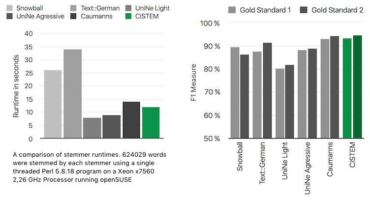

# CISTEM

## Performance
We did a comparative analysis of six publicly available german stemmers, which revealed CISTEM to be great regarding both stemming performance and speed.

## Paper
Read the paper [http://cis.lmu.de/~weissweiler/cistem/](https://cis.lmu.de/~weissweiler/cistem/)
